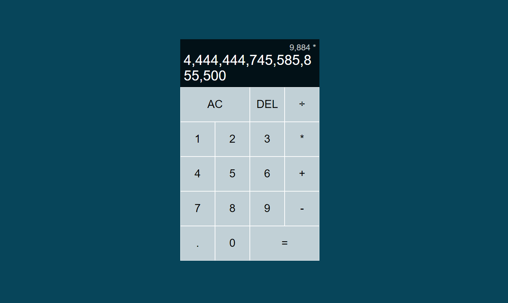

# Calculator Build with Intermadiate Vanila JavaScript

This is project that build with Vanila JavaScript, I use Best ES6 Method Use Grid and Flex Combine with this UI and perform some Intermadiate Funality

## Authors

- [@nomankhokhar](https://www.github.com/nomankhokhar)

## Badges

## 🚀 About Me

I'm a full Stack Developer...